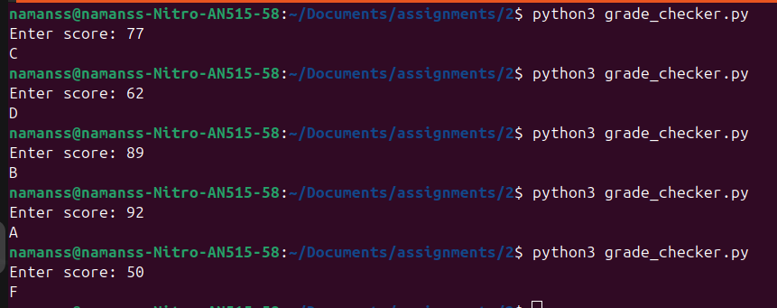
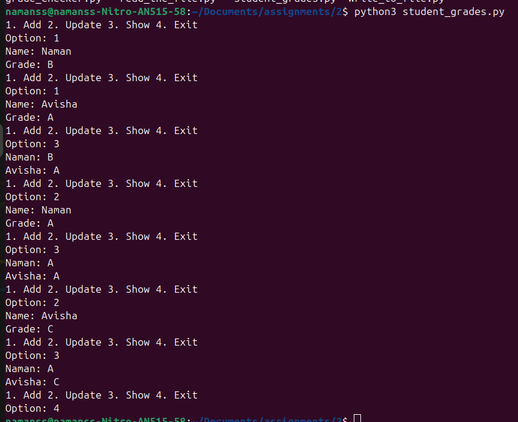

# Python Assignment

4 basic Python programs:

## 1. Grade Checker
`grade_checker.py` - Grade based on score

## 2. Student Grades
`student_grades.py` - Student grade dictionary

## 3. File Operations
`write_to_file.py` - Write to file  
`read_the_file.py` - Read from file

